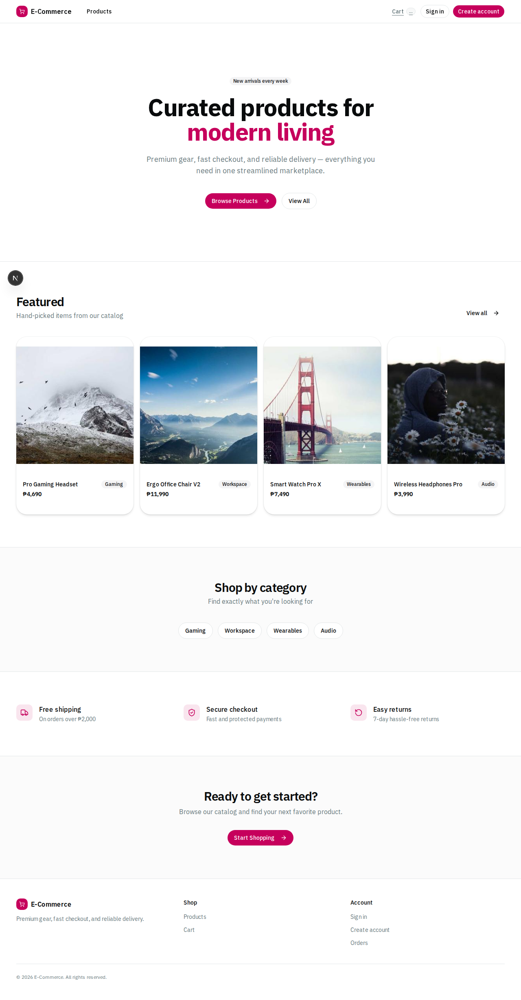

# E-Commerce



A full-stack e-commerce application built as a monorepo — product catalog, shopping cart, checkout, order management, and admin dashboard.

## Tech Stack

### Frontend (`apps/web`)
| Technology | Version |
|---|---|
| Next.js | 16.1.6 |
| React | 19.2.4 |
| TypeScript | 5.9.3 |
| Tailwind CSS | 4.1.18 |
| shadcn/ui | 4.2.0 |
| TanStack Query | 5.97.0 |
| Zustand | 5.0.12 |
| Recharts | 3.8.1 |
| BetterAuth | 1.6.2 |
| Sonner | 2.0.7 |

### Backend (`apps/api`)
| Technology | Version |
|---|---|
| NestJS | 11.1.6 |
| Prisma | 7.7.0 |
| PostgreSQL | — |
| Express | 5.2.1 |
| Stripe | 22.0.1 |
| BetterAuth | 1.6.2 |

### Tooling
| Tool | Version |
|---|---|
| pnpm | 10.33.2 |
| Turborepo | 2.8.17 |
| Biome | 1.9.4 |

## Features

**Storefront**
- Product catalog with search and category filtering
- Product detail pages with stock info and images
- Shopping cart with quantity management
- Checkout with shipping options and payment method selection (COD / mock card)
- Order history with status timeline

**Admin Dashboard**
- Revenue and order analytics with charts
- Order management with status updates
- Product CRUD (create, edit, feature, deactivate, delete)
- Stock management

**Auth**
- Email/password authentication via BetterAuth
- Session-based auth with middleware protection
- Admin password gate for admin routes

**UX**
- Responsive design (mobile + desktop)
- Loading skeletons, error boundaries, empty states
- Toast notifications on all user actions

## Project Structure

```
e-commerce/
├── apps/
│   ├── web/          # Next.js 16 frontend
│   └── api/          # NestJS 11 backend
├── packages/
│   └── ui/           # Shared shadcn/ui components
├── turbo.json        # Turborepo config
└── package.json      # Root workspace
```

## Environment Variables

Copy the template and fill in real values before running locally or deploying:

```bash
cp .env.example .env
```

Required keys:
- NEXT_PUBLIC_AUTH_BASE_URL (usually http://localhost:4000 in local dev)
- BETTER_AUTH_URL (API base URL for Better Auth)
- BETTER_AUTH_SECRET (long random secret)
- BETTER_AUTH_TRUSTED_ORIGINS (comma-separated allowed origins, e.g. http://localhost:3000)
- DATABASE_URL (PostgreSQL connection string)
- ADMIN_PASSWORD (admin panel gate password)
- PORT (API port; default 4000)

Email (password reset):
- RESEND_API_KEY — get a free key at https://resend.com. Omit in local dev to fall back to console logging.
- RESEND_FROM_EMAIL — must be a verified sender in your Resend account (e.g. no-reply@yourdomain.com)

Payments:
- PAYMENT_PROVIDER=mock for local/demo
- PAYMENT_PROVIDER=stripe for real cards (requires STRIPE_SECRET_KEY and STRIPE_WEBHOOK_SECRET)

## Quick Start

```bash
# Install dependencies
pnpm install

# Set up environment
cp .env.example .env
cp .env.example apps/api/.env
cp .env.example apps/web/.env.local

# Set up database
pnpm --dir apps/api run db:migrate
pnpm --dir apps/api run db:generate
pnpm --dir apps/api run db:seed

# Run both apps
pnpm run dev:all
```

- Frontend: http://localhost:3000
- API: http://localhost:4000

## Railway Deployment

Each app has its own `railway.toml`. Deploy them as two separate Railway services connected to the same Postgres database add-on:

1. Create a new Railway project and add a **PostgreSQL** plugin.
2. Add two services — point one at `apps/api` and one at `apps/web`.
3. Set the required env vars on each service (see the matrix below).
4. Railway will pick up the `railway.toml` in each service's root and run the correct build/start commands automatically.
5. The API service runs `prisma migrate deploy` before each deployment.

| Variable | API service | Web service | Notes |
|---|---:|---:|---|
| `DATABASE_URL` | yes | no | Railway Postgres connection string |
| `PORT` | optional | optional | Railway provides this automatically |
| `BETTER_AUTH_URL` | yes | yes | Public API origin, e.g. `https://api.example.com` |
| `BETTER_AUTH_SECRET` | yes | yes | Same secure random value on both services |
| `BETTER_AUTH_TRUSTED_ORIGINS` | yes | no | Web origin(s), comma-separated |
| `NEXT_PUBLIC_AUTH_BASE_URL` | no | yes | Public API origin used by the browser |
| `ADMIN_PASSWORD` | no | yes | Admin route password gate |
| `RESEND_API_KEY` | yes | no | Required for production password reset / order emails |
| `RESEND_FROM_EMAIL` | yes | no | Verified Resend sender |
| `PAYMENT_PROVIDER` | yes | no | `mock` or `stripe` |
| `STRIPE_SECRET_KEY` | yes, if Stripe | no | Required when `PAYMENT_PROVIDER=stripe` |
| `STRIPE_WEBHOOK_SECRET` | yes, if Stripe | no | Required for Stripe webhooks |

## Deployment Checklist

1) Environment
- Configure all required env vars in production (see section above)
- Use secure values for BETTER_AUTH_SECRET and ADMIN_PASSWORD
- Set BETTER_AUTH_TRUSTED_ORIGINS to your deployed web origin(s)
- Ensure DATABASE_URL points to production Postgres

2) Database
```bash
pnpm --dir apps/api run db:generate
pnpm --dir apps/api run db:migrate:deploy
pnpm --dir apps/api run db:seed   # run only when appropriate for your environment
```

3) Quality gates
```bash
pnpm run lint
pnpm run typecheck
pnpm run build
pnpm --dir apps/api run test --runInBand
```

4) Run apps
- Web: `pnpm --dir apps/web start`
- API: `pnpm --dir apps/api start:prod`

5) Post-deploy smoke tests
```bash
# full smoke checks (web + api)
WEB_BASE_URL=https://your-web-domain API_BASE_URL=https://your-api-domain pnpm run smoke:postdeploy

# payment endpoints smoke checks (against API)
BASE_URL=https://your-api-domain pnpm run smoke:payments
```

Expected smoke outcomes:
- `/health` returns `{ status: "ok" }`
- `/products` returns non-empty `items`
- web `/` and `/products` return 200
- unauthenticated `/admin` redirects to `/admin/login`
- `/api/admin/auth` rejects wrong password and accepts `ADMIN_PASSWORD`

## Key Routes

| Route | Description |
|---|---|
| `/products` | Product catalog |
| `/products/:slug` | Product detail |
| `/cart` | Shopping cart |
| `/checkout` | Checkout flow |
| `/orders` | Order history |
| `/orders/:id` | Order detail |
| `/account` | User account |
| `/admin` | Admin dashboard |
| `/admin/orders` | Order management |
| `/admin/products` | Product management |

## License

This project is licensed under the [MIT License](./LICENSE).
